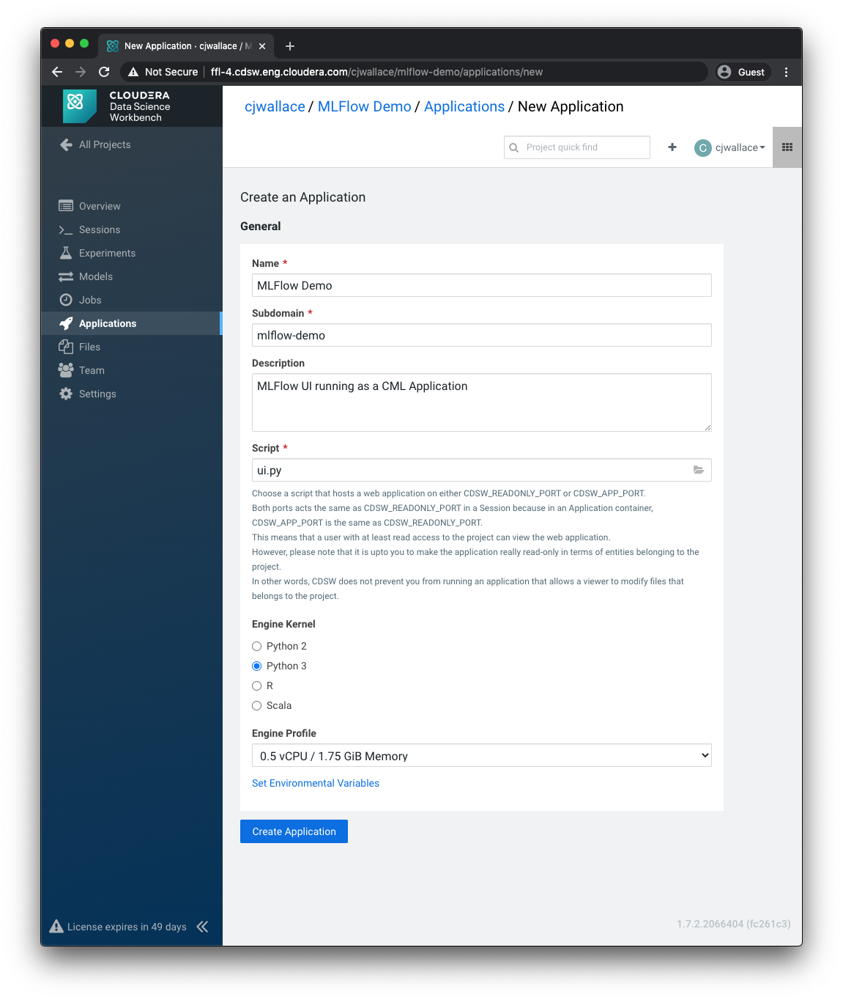
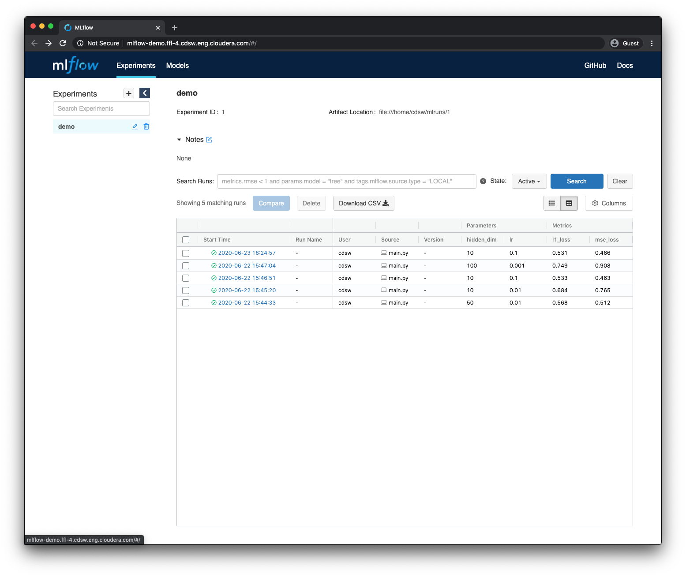

# MLFlow Demo

> MLflow is an open source platform to manage the ML lifecycle, including experimentation, reproducibility, deployment, and a central model registry.
> 
> [mlflow.org](https://www.mlflow.org/)

In this project, we'll use only the experiment tracking component of MLFlow.

We can run the MLFlow UI inside CML and CDSW as an application.
This repo is a small demonstration of how to set up a minimum version of that, on a completely toy problem.

## MLFlow in 60 seconds

This repo is only concerned with the tracking component of MLFlow. There are three important concepts:
* `experiments` - these group together runs. Different experiments appear as different tabs in the UI.
* `params` - params are things you _set_ for a training run. For instance, the learning rate for stochastic gradient descent.
* `metrics` - metrics are things that are _computed_ during a training run. They can be one per run, or one per algorithm step. For example, the loss for each epoch while training a neural network would be a metric.

MLFlow logs everything to an `mlruns` directory, and has a UI for viewing metrics across and within runs.

### Structure

There are two scripts.

`main.py` is where the action happens.
In that script, we generate some toy data, then train a small neural network with pytorch to (over) fit the data.
We instrument the script with MLFlow.

`ui.py` is how we launch the MLFlow UI as a CML/CDSW application.

In a larger project, we'd want to separate the concerns in `main.py` into independent software modules.
For our purposes, a single script is fine.

### Running the app

#### Setup

Begin by cloning this project into a fresh CML or CDSW project.

Then, install dependencies:

1. Start a new Python 3 session. PyTorch is a hefty dependency, and requires about 4GB of memory during installation, so be sure to start a large enough session.
2. Inside the session, run `!pip3 install -r requirements.txt`

#### Training

Next, we'll train some models fake data.
Different data will be generated each time, so comparing models is meaningless.
Since our goal is just to see MLFlow working, this doesn't matter at all.

The `main.py` script accepts command line arguments for a couple of things we might like to tweak between runs.
We could set up CDSW jobs or experiments to run these.
For now, a session will do.

Open a Python 3 session, and run the script a few times with different arguments.
This can be done from the terminal window, or in the session itself with `!python3 main.py --lr 0.1 --hidden 10`.
Try a few different values of `lr` (learning rate) and `hidden` (the number of neurons in our neural network's hidden layer).
There won't be any output, but a directory named `mlruns` should be created.

#### Viewing the UI

Create an Application for the MLFlow UI.
Give it a name, subdomain (it will be accessible at `subdomain.cdsw.whatever.com`) and point it at the `ui.py` script.
The script uses the `CDSW_READONLY_PORT` environment variable, so there should be no additional config needed there.

Now, navigate to the subdomain you specified, and you should see the results of our earlier runs.

